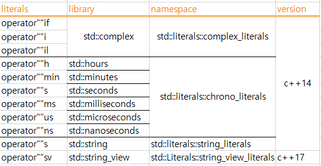

# C++ 11/14 기본문법#4

- [C++ 11/14 기본문법#4](#c-1114-기본문법4)
	- [1. scoped enum](#1-scoped-enum)
	- [2. user define literal](#2-user-define-literal)
	- [3. delete / default function](#3-delete--default-function)
		- [3.1 delete function](#31-delete-function)
		- [3.2 default function](#32-default-function)
	- [4. override & final](#4-override--final)
		- [4.1 override - 재정의](#41-override---재정의)
		- [4.2 final](#42-final)
		- [4.3 퀴즈 - 답은 제공 안됨.](#43-퀴즈---답은-제공-안됨)

## 1. scoped enum

c++ 11 문법

기존의 enum의 단점을 개선한것.

예 - 기존 enum의 단점

```cpp
#include <iostream>
#include <type_traits>
using namespace std;

enum Color { red = 1, green = 2 }; // [*] red의 type을 몰라서, 그냥 컴파일러가 int나 unsigned int로 임의로 잡아줌 - 단점임

int main()
{
	int n1 = Color::red;
	int n2 = red; // [*] 기존 enum은 이렇게도 사용가능. - 단점임
	int red = 0;  
	int n3 = red; // [*] 이러면 enum의 red인지, 지역변수 enum 인지 헷갈리게 됨, 물론 c, c++은 가장 가까운걸 선택하니까. 여기서는 지역변수

	cout << typeid(underlying_type_t<Color>).name()<< endl; // [*] underlying_type_t<Color> 는 Color의 요소의 type를 출력해줌, 
															// [*] 타입의 이름 출력을 해야 하니 typeid로 감 싸준다. 
															// [*] c++filt -t로 출력 결과 pipe해서 맹글링 제거해서 보면 됨.
}
```

- 기존 enum 상수의 단점
    - 타입의 이름 없이 사용 가능 - unscoped enum
    - 요소의 타입을 지정할 수 없다.
- 요소의 타입을 알아내는 방법 - c++ 11에서만 가능
    - type_traits를 사용하는 방법임
    - `underlying_type<Color>::type` 또는
    - `underlying_type_t<Color>:`

**c++11에서 추가된 새로운 enum (scoped enum)**
```cpp
#include <iostream>
#include <type_traits>
using namespace std;

// C++98/03
//enum Color { red = 1, green = 2 };

// C++11
enum class Color : char { red = 1, green = 2 }; // [*] 콜론 뒤에 요소의 type 명시가 가능해짐. 생략하면 default로 int가 됨.

int main()
{
//	int n1 = Color::red; // error [*] red는 int type이 아니다 Color type이다.

	Color n1 = Color::red; // ok
	int   n2 = static_cast<int>(Color::red); // ok [*] 명시적 casting하면 갠춘.

	int n3 = red; // error

	cout << typeid(underlying_type_t<Color>).name() << endl;
}
```

## 2. user define literal

```cpp
#include <iostream>
using namespace std;

// _ : 사용자 사용가능.
// _ 로 시작하지 않는것 : reserved ( 미래에 c++에서 쓸수도 있음 )
int operator""_k(unsigned long long v) //[*] user define literal에서는 param의 type이 정해져 있다. (쓸수있는 type이 있음 )
{
	return 1000 * v; // k는 1000이니까.
}

int main()
{
	int n1 = 10; // meter [*] 만약 단위를 적어주고 싶다면? e.f 10m 또는 10k 근데 이런건 기존에 안됬지만, c++11부터 가능
					 // [*] 즉 10k라고 쓰면 컴파일러는 operator""k(10) 를 호출해준다. 즉 operator""k 를 정의해주면됨.
					 // [*] g++에서는 user define literal은 _ 로 시작하는 것을 권장하기 때문에, 본 예에서는 _k를 사용함
					 //	[*] 실제로 k같은 것들은 미래의 c++에서 사용할지 몰라서 이미 예약되어 있다함. 그래서 컴파일시 warning이 나옴. 
	int n2 = 10_k;// 10000  operator""k(10)

	cout << n2 << endl; /// 10000
}
```

c++ 에 있는 literals의 종류  
1. integer literals : 11, 013, 0xa, 0b1011
2. floating point literals : 15.75, 1.57E1, 157e-2
3. character literals : 'A', 'a'
4. string literals : "hello", "c++"

user define literal  
- literal 뒤에 사용자 정의 접미사(suffix)를 붙이는 문법.
- literal이 값 뿐아니라 단위를 가질수 있게 된다. ( e.g 단위를 곱해서 사용가능해짐 )
- `operator""suffix`
- 사용자가 제공하는 접미사는 반드시 "_"로 시작해야 한다.
- _가 붙지 않는 것은 c++ 표준 라이브러리를 위해서 예약 되어 있음

```cpp
class second
{
	int value;
public:
	second(long long s) : value(s) {}
	// [*] 여기에 변환 연산자 둬서 minute객체가 - second객체로 되거나 하게 할수도 있다.
};

class minute
{
	int value;
public:
	minute(long long s) : value(s) {}
};

second operator""_s(unsigned long long v) // [*] B. 이렇게 객체를 return할수도 있음
{
	return v; // [*] B. 컴파일러에의해 변환 생성자 호출됨.
}

minute operator""_m(unsigned long long v)
{
	return v;
}

int operator""_k(unsigned long long v) //[*] A. 정해진 규칙에 의해 param의 type 세팅
{
	return v * 1000;
}

int main()
{
	int n1 = 10_k; // operator""k(10)
	cout << n1 << endl; // 10000

	second n1 = 10_s; // [*] C. 사실 c++표준에 10s, 10m처럼 m,s는 이미 준비되 있다. 아래 예를 반드시 참조.
	minute n2 = 10_m;
}
```

**user define literals과 함수 인자(규칙)**

| literal의 종류          | 함수모양                                 | 비고                                                           |
| :---------------------- | :--------------------------------------- | :------------------------------------------------------------- |
| integer literals        | `operator""suffix(unsigned long long)`   | const shar*로 쓰면 상수값이 문자열로 변환되서 param으로 전달됨 |
|                         | `operator""suffix(const char*)`          |
| floating point literals | `operator""suffix(long double)`          | const shar*로 쓰면 상수값이 문자열로 변환되서 param으로 전달됨 |
|                         | `operator""suffix(const char*)`          |
| character literals      | `operator""suffix(char) `                |                                                                |
| string literals         | `operator""suffix(const char*, size_t) ` |                                                                |


**c++ 표준에 있는 사용자 정의 literals**
```cpp
#include <iostream>
#include <string>
#include <chrono>
using namespace std;
using namespace std::chrono;
//using namespace std::literals::string_literals; [*] 컴파일시 error 나면 이거 넣으면 됨 ( 대부분은 안넣어도 됨 )
//using namespace std::literals::chrono_literals;
using namespace std::literals; // [*] 이렇게 하면 모든 literals가 열림.

void foo(string s)      { cout << "string" << endl; } // 1
void foo(const char* s) { cout << "char*" << endl; }  // 2

int main()
{
	foo("hello"); // char*                        [*] 일단 2가 불림, 문자열의 정확한 type이 그거니까.
	foo("hello"s); // string operator""s("hello") [*] 표준에 이미 정의된 literal사용.

	seconds s1 = 10s; // [*] std::chrono에 있는것, 여기서의 s는 integer에 정의 된것, 위 s는 string에 대해 정의된것.
	minutes m1 = 10min;

	//minutes m2 = 120s; // [*]이건 에러남, 캐스팅 필요..하기 때문,,이건 쫌 복잡해서 강의에선 생략.
	seconds s2 = 10min; // [*] 대신 이건 됨.
	cout << s2.count() << endl; // 600
}
```

- c++11 이후 부터는 사용자 정의 문법이 자주 등장하니까 알아둬야 한다함
  - 


## 3. delete / default function

### 3.1 delete function

```cpp
#include <iostream>
using namespace std;

void foo(int n)
{
	cout << "foo(int)" << endl;
}

//void foo(double); // 선언만. [*] B. 컴파일러의 암시적 변환을 막을려면 그냥 선언만 해둠, 결국 linker가 함수를 못찾아서 link error를 내는 원리
							// [*] B.근데 문제는 이게 컴파일에러는 내는게 아니라 link 에러를 내준다는 것. 즉, g++ 에 -c 옵션 줘서 소스를 컴파일만 하는경우
							// [*] B. 에러가 없음. "즉 library를 만들어 배포할땐 에러가 없다는거!!"

//void foo(double) = delete; // C. [*] 컴파일러한테 foo(double)를 지워달라는 문법 -c++11문법

int main()
{
	foo(3.4); // foo(double) [*] A.일단은 컴파일은 성공, 컴파일러가 알아서 형변환해서 foo(int n) 호출
			  //             [*] B.이런 암시적 변환은 에러의 원인이 될수도 있다. ( 사용자가 의도한 바가 아니므로.. )
			  //             [*] C. foo(double)를 지운 뒤에는 컴파일시 에러 메시지로 삭제된 함수를 사용하고 있다고 나옴.
}
```

**함수 삭제 문법(delete function ) 정리**  
- c++11에서 추가된 문법, 함수를 삭제 해 달라는 문법
- 함수를 제공하지 않을 떄, 선언만 제공할 때, 삭제할 때의 차이점은 다음과 같다.
    1. 제공하지 않을때 : 함수 호출시 인자가 변환 가능한 타입을 가지는 `동일 이름의 다른 함수 호출`
    2. 선언만 제공 할때 : 함수 호출시 `링크 에러`
    3. 삭제 할때 : 함수 호출 시 `컴파일 에러`

**예 - 함수를 삭제하는 다양한 경우)**  
```cpp
template<typename T> void goo(T a)
{
}

//void goo(double) = delete;
					 // [*]A. 이렇게 하면 goo(3.4) 호출시 template 버전보다, 일반함수 우선호출되니까, 이걸 호출하는데 삭제 됬네? 그래서 
					 // [*]A. 컴파일러가 에러 출력해줌. 

class Mutex
{
public:

	Mutex(const Mutex&) = delete;          //[*] C. 복사 생성자 삭제
	void operator=(const Mutex&) = delete; //[*] C. 대입 연산자 삭제 ( 복사가 안되면 대입도 안되게 하는게 좋음 )

//private: // [*]  B. 복사 생성자 호출 막으려는 고전 기법
//	Mutex(const Mutex&);
};

int main()
{
	goo(3.4); //[*] template type 명시 안해줘도 되나보네..

	Mutex m1;
	Mutex m2 = m1;  // [*] B. 뮤텍스는 자원을 독점하는 동기화 객체인데,, 이렇게 복사되면 안됨.
					// [*] B. 복사 생성자 호출됨. 에러 안남. 그래서 예전에는 복사 생성자를 위 Mutex class처럼  private 영역에 두었다. 
					// [*] B. 그러면 복사 생성자 호출시 에러남 private 멤버에 접근 하므로.. (이건 문법이아니라 테크닉)

}
```

- 함수 삭제는 보통 복사 생성자와, 대입 연산자 삭제에 많이 씀
- 함수 삭제는 public , private에 둘수 있는데, 쪼금 옛날 컴파일러는 private에 뒀을시 에러 메시지를 함수가 삭제되어 호출이 안된다는 메시지가 아닌, private라서 안된다는 메시지를 주기도 함.. 그래서 일단 public에 두는게 좋음.

**함수 삭제 활용처**
- 일반 함수 삭제
- 함수 템플릿을 만들 때 특정 타입에 대해서 삭제
- 멤버 함수 삭제, 복사 생성자와 대입연산자를 삭제하는 기법이 널리 사용됨
- 싱글톤, 복사 금지 스마트 포인터(unique_ptr), mutex에 사용됨.

### 3.2 default function

delete function과 반대 되는 개념

```cpp
#include <iostream>
#include <type_traits>
using namespace std;

struct Point
{
	int x, y;

	Point() {} // 사용자가 생성자 제공.  [*] A. Point p1; 코드는 default 생성자가 필요하므로..

	//Point() = default; // 컴파일러가 제공. [*] A. 굳이 위처럼 사용자가 생성자를 만들 필요가 없다. 
    //Point(const Point& ) = default; [*] A.  복사 생성자도 가능
 
  Point(int a, int b) : x(a), y(b) {}
};

int main()
{
	Point p1{};  //[*] 이게 뭔진 다른 강좌에서 나옴. - value 초기화

	cout << p1.x << endl; // default 생성자 - 0 [*] 위 Point class에서 Point() {} 대신 Point() = default; 썻을때 결과, 즉 변수가 초기화 되어있음
						  // 사용자가 제공 - garbage [*] Point() {} 쓰면 멤버 변수가 초기화가 안되어 있음. 

	cout << is_trivially_constructible<Point>::value << endl;
}
```

1. 사용자가 default 생성자를 제공 vs default 문법이용 ( or 아무 생성자도 없어서 default를컴파일러가 직접 제공) 의 차이
    - trivial에서도 언급했듯 `Point() {}` 처럼 사용자가 직접 default 생성자를 제공한것은 trivial하지가 않다.  
    - ⇒ 이게 왜 그러냐면, 생성자를 선언만 하고 `Point();` 정의를 다른데가 할수 있는데, 이경우 컴파일러는 정의에서 뭔짓을 하는지 모르니까
    - ⇒ trivial 하지 않다고 처리할수 밖에 없음. (  `Point() {}` 는 정의도 같이 있지만,, 뭐 컴파일러는 일단 Point()까지만 보나보지.. 일단 강사는 이부분을 언급하진 않음)

default function 정리

- 함수 삭제(delete function)과는 반대 개념으로 `함수의 디폴트 구현을 제공해 달라`는 표현
- 사용자가 생성자의 구현을 제공할 때와 default 구현을 제공 받을 때의 차이점.
    | Name                 | Trivial 여부 | value initailization          |
    | :------------------- | :----------- | :---------------------------- |
    | `Point() {}`         | X            | 멤버가 0으로 초기화 되지 않음 |
    | `Point() = default;` | O            | 멤버가 0으로 초기화 됨.       |
---

## 4. override & final

c++ 11 에 도입된 키워드

### 4.1 override - 재정의

```cpp
class Base
{
public:
	virtual void f1(int) {}
	virtual void f2() const {}
	virtual void f3() {}
			    void f4() {}
};
/* Q. 상속해서 가상함수 재작성 하는데.. 실수를 아래와 같이 해버림;;
      문제는 컴파일 해도 아래 코드는 에러가 안남.
			왜냐면 컴파일러는 그냥 새로운 가상함수를 만들었구나.. 생각하기 때문..
class Derived : public Base
{
public:
	virtual void f1(double)  {} // [*] int 대신 double로 착각
	virtual void f2() {}        // [*] const를 빼먹음 ( 원래 상수함수는 "같은 이름의 비상수 함수도 많들수 있음" )
	virtual void foo3()  {}     // [*] 함수 이름을 실수.
	        void f4()   {}      // [*] 가능하지만 위험.( 오버라이딩-재정의 한거 )
};
*/

// [*] 위문제는 override - 재정의 키워드 쓰면 된다 ㅎ, 그럼 컴파일러가 에러 잡아줌.
class Derived : public Base
{
public:
	virtual void f1(int) override {}
	virtual void f2() const override {}
	virtual void f3() override {}
	//void f4() override {} // [*] 이건 가상함수가 아닌데 재정의 하려고 하니까 error내줌.. 이제는 ㅎ
};

int main()
{

}
```

- 가상 함수 재정의 시 override를 붙이면 보다 안전한 코드를 작성 할 수 있다. (  반드시 그래야 하는것은 아님 )  
  ⇒ 과거 코드들은 override keyword를 안썻기 때문에, 문법적으로 강제하면 에러 날수 있어서, 강제하지는 않았다고 함.

### 4.2 final

```cpp
#include <type_traits>
#include <iostream>
using namespace std;
class A
{
public:
	virtual void f1() {}
};

class B final : public A // [*] class에 final을 써주면, 이는 더이상 파생클래스를 만들수 없다는 의미, 즉 B는 이제 파생 클래스 못만듬.
{
public:
	virtual void f1() override final{} //[*] override 키워드 앞, 혹은 뒤에 final keyword를 붙일수 잇따. 
};

/*
class C : public B
{
public:
	//virtual void f1() override  {} // [*] B에서 f1에 대해 final을 썻기 때문에, override-재정의 불가.
};
*/
int main()
{
	bool b = is_final<B>::value; //[*] final인지 알아내는 방법. c++14에 추가됨
	cout << b << endl;
}
```

**final specifier**  
- 가상함수 뒤에 붙이는 경우 : 해당 가상 함수를 파생 클래스에서 더 이상 재정의 할 수 없다.
- 클래스 뒤에 붙이는 경우  : 파생 클래스를 만들 수 없다.

**is_final**  
- c++ 14 에서 추가된 traits
- 사실 자바에 있던 개념
- 가상함수 상속할때, 자식에서 해당 함수에 virtual을 붙이진 않아도 되는듯.. 예에서는  모두 붙였지만..

### 4.3 퀴즈 - 답은 제공 안됨.

```cpp
#include <iostream>
using namespace std;

template<typename T> class Base
{
public:
	virtual void foo(const T a)
	{
		cout << "Base foo" << endl;
	}
};

class Derived : public Base<int*>
{
public:
	// [*] 문제는 아래와 같음. 
	// 가상 함수 foo를 재정의해서
	// "Derived foo" 라고 출력해 보세요.
	// override 사용하지 말고. ( 이걸 사용하면 내가 가상 함수 잘못만든걸 쉽게 파악하니까.. )
	// [*] 이거 쫌 애매 하넫.. 
	// [*] 일단 가상함수를 override하는건데.. Base<int*>의 가상함수 foo을 재정의하는거
	// [*] 생각해 줄건, override하는 함수를 Base<int*> 꺼라는걸 어떻게 알려줄것인가.. 인듯.. 
	// [*] 준내어렵네.. 해결이 안대는데..?
	// [*] 답은 아래와 같다. android studio에서 자동 override생성 기능으로.. 만들었음.. 에휴.. 
	// [*] 아마. Base의 foo함수의 define을 뽑는 코드를 이용해서 param을 봤어야 알수 있었을듯..;; 정석 대로 라면.. 
	// [*] ref. https://www.geeksforgeeks.org/difference-between-const-int-const-int-const-and-int-const/ 
	void foo(int *const a) override
	{
		cout << "Derived foo" << endl;
	}
};

int main()
{
	Base<int*>* p = new Derived;
	p->foo(0);	// "Derived foo"
}
```